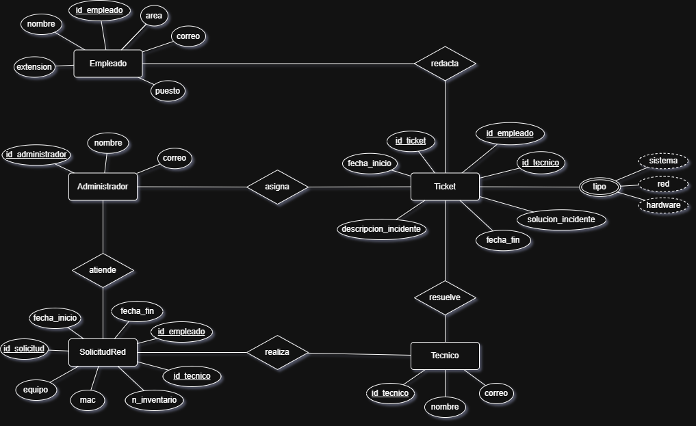
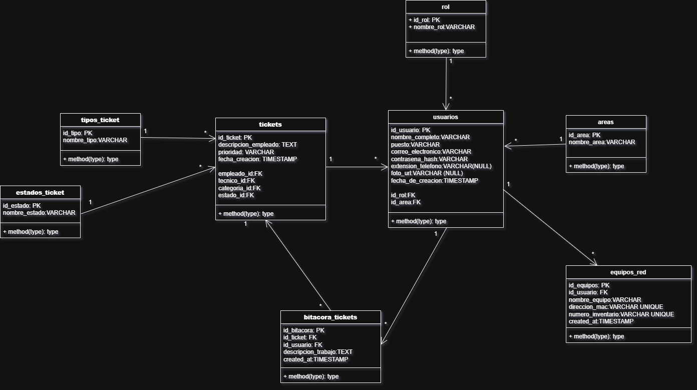

# SoportITO

            Instituto Tecnólogico de Oaxaca
            Ing. en Sistemas Computacionales
                
            Equipo 7:
            Badiola Barrita Jonathan
            Flores Santiago Wilver Alfredo

            Grupo: 7SB
                
            Docente: Martinez Nieto Adelina

## Descripción 
__SuportITO__  es una aplicacion web  para dar _soporte tecnico_ a los empleados de una empresa mediante la _gestion de tickets_.
La funcion de la aplicacion es, ser el medio para reportar fallas de diferentes tipos (hardware, software o red), gestionar los reportes mediante tickets, asignar tecnicos para solucionar los tickets y llevar un registro de incidencias centralizado.

### Problematica
Es un sistema que nos va a permitir almacenar de forma segura y continua las solicitudes que se realicen dia a dia en alguna empresa en los temas de soporte tecnico, como son los problemas de algun otro sistema (como ejemplo puede ser fallo al subir algun archivo, fallo de ingreso al sistema), de algun fallo tecnico (como computadora lenta, creacion de carpeta compartida, etc) en algun equipo y en algun fallo en la red dentro de la empresa (puede ser una computadora sin internet, impresora sin internet, etc).

Se busca que cada empleado cuente con un usuario para ingresar al sistema, con la finalidad de realizar alguna solicitud y al mismo tiempo monitorear el seguimiento e historial de las solicitudes ya realizadas.

## Modulos
Indicar los modulos principales del sistema (minimo 4 entidades no triviales)
Modulos propuestos:
- Usuarios
- Tickets
- Equipos de red
- Roles


## Roles de usuario
__SuportITO__ contará con tres roles de usuarios donde cada uno tiene definida sus propios permisos y responsabilidades. Los roles son

- __Empleado:__ Prodra crear una solicitud, asi como monitorear el segumiento del ticket y el historial de tickets solicitados

- __Administrador:__ El Administrador del sistema al recibir la solicitud de algun empleado, esta sera analizada y turnada al personal especializado en el tema de ayuda.

- __Tecnico:__ Se encargara de solucionar el problema de su ticket o tickets asignados, tendra la responsabilidad de actualizar el estado del ticket y detallar lo realizado. esto con la fianlidad de poder tener una bitacora de lo realizado.

## Tecnologias utilizadas
### Frontend
- HTML 5
- CSS 3
- JavaScript
- React
- Vite
- Node.js

### Backend
- PHP
- Laravel
- Composer

### Servicios
- VPS
- MySQL
- Nginx
- Postfix
- Twilio

### Herramientas CASE
- Draw.io
- GitHub
- GitHub Proyects

## Guía de Instalación
### Requisitos del sistema
- PHP 8.4 o superior
- Composer
- Node.js
- FPM 8.4

### Descarga
Descarga o clona este repositorio en tu propia maquina.

### Instalacion de dependencias
Para instalar los paquetes necesarios del frontend ejecuta el comando `npm install` en la raiz del proyecto ``.\react_front``


Para instalar los paquetes necesarios del backends ejecuta el comando `composer install` en la raiz del proyecto ``.\laravel_back``

### Configuracion de las variables del sistema
En la carpeta `.\laravel_back` crea un archivo `.env` basado en el archivo `.env.example`.  
Configura las siguientes variables según tu entorno:

```
APP_NAME=SuportITO
APP_ENV=local
APP_KEY=base64:GENERADO_POR_ARTISAN
APP_DEBUG=true
APP_URL=http://localhost

DB_CONNECTION=mysql
DB_HOST=127.0.0.1
DB_PORT=3306
DB_DATABASE=suportito_db
DB_USERNAME=root
DB_PASSWORD=tu_password

MAIL_MAILER=smtp
MAIL_HOST=smtp.gmail.com
MAIL_PORT=587
MAIL_USERNAME=tu_correo
MAIL_PASSWORD=tu_password
MAIL_ENCRYPTION=tls
MAIL_FROM_ADDRESS=tu_correo
MAIL_FROM_NAME="SuportITO"
```

Genera la clave de la aplicación con:

```bash
php artisan key:generate
```

### Ejecutar el sistema

1. Inicia el backend desde la carpeta `.\laravel_back`:
   ```bash
   php artisan serve
   ```
   Esto levantará el servidor en `http://127.0.0.1:8000`.

2. Inicia el frontend desde la carpeta `.\react_front`:
   ```bash
   npm run dev
   ```
   Esto levantará el cliente en `http://localhost:5173`.

3. Accede al sistema desde el navegador usando las credenciales por defecto.

---


## Guía de Inicio
El proyecto tiene las siguientes credenciales por default para poder probar el sistema:
```
Nombre: admin
Correo: admin@correo.com
Contraseña: Adm1n1$trad0r
```

## Diseño del sistema

### Diagrama Entidad-Relacion



### Modelo Relacional


## Link a los recursos
- Link para el repositorio en [GitHub](https://github.com/badiolajh/Projecto-Final_Tickets)
- Link para el tablero en [GitHub_Proyects](https://github.com/users/badiolajh/projects/1)
- Link a mockup de figma:
  - Mockup para rol de administrador: [vista_administrador_figma](https://www.figma.com/proto/BKdEkqmCxr3Su8fVLPDhkY/Proyecto-tickets?node-id=1-253&p=f&t=KGyI5SY7SHO9KHBS-1&scaling=scale-down&content-scaling=fixed&page-id=0%3A1&starting-point-node-id=1%3A253)
  
  - Mokup para el rol de empledo: [vista_empleado_figma](https://www.figma.com/proto/BKdEkqmCxr3Su8fVLPDhkY/Proyecto-tickets?node-id=66-1055&p=f&viewport=614%2C459%2C0.19&t=RS7ZgpvY0NDDOHde-1&scaling=scale-down&content-scaling=fixed&starting-point-node-id=66%3A1055&page-id=38%3A2)

  - Mokup para el rol de tecnico: [vista_tecnico_figma](https://www.figma.com/proto/BKdEkqmCxr3Su8fVLPDhkY/Proyecto-tickets?node-id=66-362&p=f&viewport=-2000%2C-299%2C0.62&t=wMwUssKte1WsT7Tg-1&scaling=scale-down&content-scaling=fixed&starting-point-node-id=66%3A1106&page-id=38%3A3)

## Link del VPS
Demo del proyecto y su acceso en el VPS  
Actualmente el sistema se encuentra en **fase de desarrollo**.  
Se están implementando la conexión del backend con el frontend y la integración con el VPS para pruebas en línea.  

Actualmente se pueden ver los avances en los siguientes enlaces:

- **Frontend:** [front.suportito.wilverafs.dev](https://front.suportito.wilverafs.dev)
- **Backend:** [back.suportito.wilverafs.dev](https://back.suportito.wilverafs.dev)
